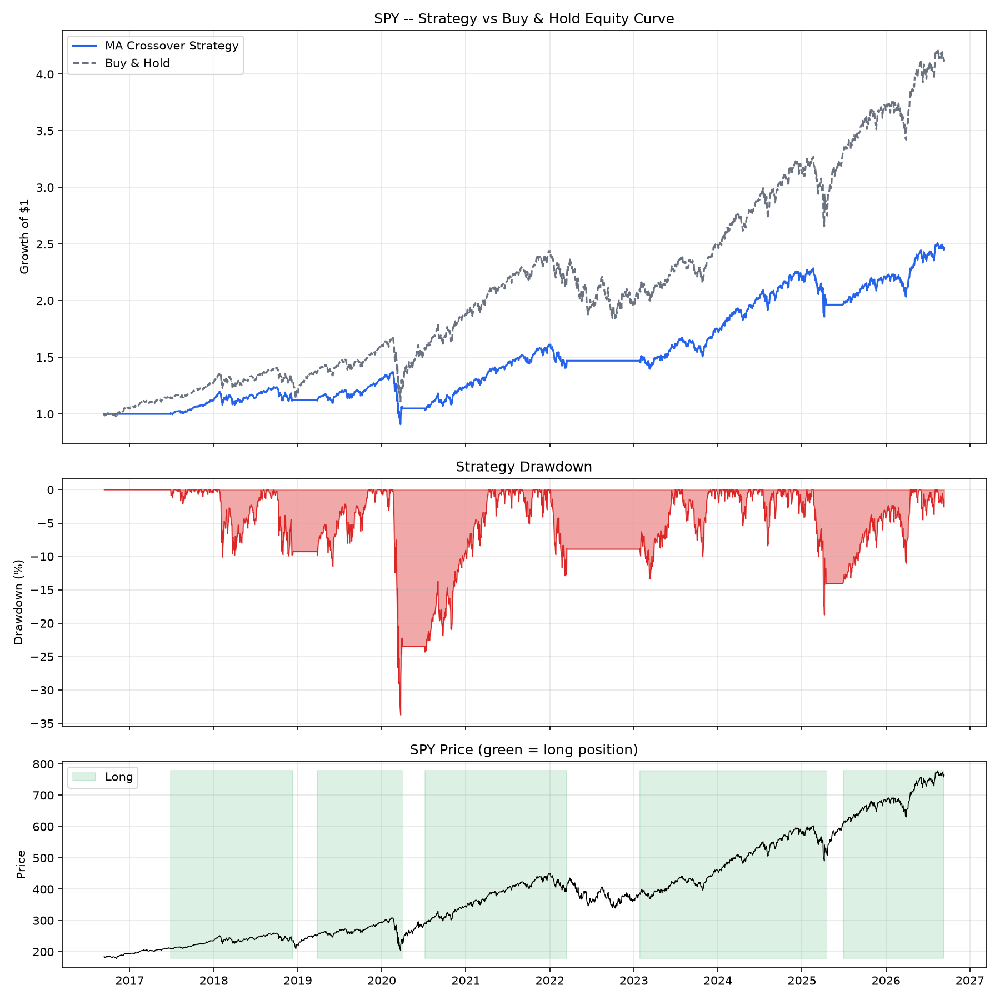

# Backtested Trading Strategy: Moving Average Crossover

A moving-average crossover strategy backtested on real historical data,
with realistic transaction costs and honest performance reporting. Part of
a broader quant portfolio (alongside options pricing models and a risk
modeling / VaR project).

## Strategy

Classic trend-following logic: go long when the short-term moving average
crosses above the long-term moving average (a "golden cross"), and exit to
cash when it crosses back below (a "death cross"). Default windows are
50-day / 200-day, a widely used convention.

**This project isn't trying to prove the strategy beats the market** --
it's trying to build a *correct, honest backtest*: no lookahead bias,
realistic transaction costs, and standard risk-adjusted performance
metrics, reported as-is.

## Design choices (stated explicitly, since these affect results)

* **No lookahead bias**: a signal confirmed on day T is only executed on
day T+1's return. You can't trade on today's close using a crossover
that isn't confirmed until today's close.
* **Transaction costs**: modeled as a fixed % of trade value (default 10
bps), covering commission + slippage combined -- a standard simplification.
* **No leverage**: the strategy is either 100% invested or 100% cash, never
short.

## Results

```bash
python run_backtest.py --ticker SPY --short 50 --long 200 --years 10
```



*Real results: 50/200-day MA crossover on SPY, 10 years of daily data.*


*| Metric | Strategy | Buy & Hold |*

*|---|---|---|*

*| Total return | 146.62% | 314.74% |*

*| CAGR | 9.47% | -- |*

*| Annualized volatility | 15.08% | -- |*

*| Sharpe ratio | 0.543 | -- |*

*| Max drawdown | -33.72% | -- |*

*| Win rate | 56.07% | -- |*

*| Number of trades | 9 | -- |*

*| Total transaction costs | 0.9% | -- |*


|Metric|Strategy|Buy & Hold|
|-|-|-|
|Total return|placeholder|placeholder|
|CAGR|placeholder|--|
|Sharpe ratio|placeholder|--|
|Max drawdown|placeholder|--|
|Win rate|placeholder|--|
|Number of trades|placeholder|--|

The top panel compares growth of $1 for the strategy vs. simple buy-and-hold.
The middle panel shows the strategy's drawdown over time. The bottom panel
shows the underlying price with long periods shaded, so you can see exactly
when the strategy was in or out of the market.


The strategy underperformed buy-and-hold over this

window, which is expected — SPY had one of the strongest sustained bull

runs in its history over the last 10 years, and trend-following strategies

structurally lag pure buy-and-hold during long uninterrupted uptrends (they

pay a cost in prior whipsaws for the protection they eventually provide).

The strategy's worst drawdown (-33.72%) coincides with the March 2020 COVID

crash: trend-following systems are inherently reactive, so they are

vulnerable to sudden shocks rather than slow declines. In exchange, the

strategy avoided being fully invested through parts of the 2022 bear

market, staying in cash for extended stretches instead. This is the

fundamental trade-off of trend-following: smoother, more protected

performance in some regimes, at the cost of lagging in others.


## Why report Sharpe ratio and drawdown, not just total return

Total return alone is misleading -- a strategy that returns 20% while
suffering a 60% drawdown along the way carries very different risk than one
that returns 20% smoothly. Sharpe ratio (return per unit of volatility) and
max drawdown (worst peak-to-trough decline) give a fuller picture of
whether the strategy's risk-adjusted performance, not just its raw return,
is attractive.

## Running it

```bash
pip install -r requirements.txt

# Run the backtest on real data (requires internet access)
python run_backtest.py --ticker SPY --short 50 --long 200 --years 10

# Generate the chart from the saved results
python notebooks/plot_backtest.py --ticker SPY

# Run tests
python tests/test_strategy.py
```

Useful flags on `run_backtest.py`:

* `--short` / `--long`: moving average windows (days)
* `--years`: how many years of history to pull
* `--cost`: transaction cost as a fraction (0.001 = 10 bps)
* `--rf`: risk-free rate used in the Sharpe ratio calculation

## Validation

All 7 unit tests pass (`tests/test_strategy.py`), including checks that:

* The strategy never trades on the same day a crossover is confirmed (no
lookahead bias)
* Transaction costs measurably reduce net returns
* A flat (unchanging) price produces exactly zero return
* The strategy correctly stays long through a clean uptrend and never goes
long in a clean downtrend

## Project structure

```
trading-strategy/
├── strategy/
│   └── ma_crossover.py     # Signal generation logic
├── backtest/
│   └── engine.py           # Backtest simulation + performance metrics
├── tests/
│   └── test_strategy.py    # Unit tests
├── notebooks/
│   ├── plot_backtest.py    # Visualization script
│   └── SPY_backtest.png    # Generated chart
├── data/                   # Saved backtest output (CSV)
├── run_backtest.py         # Main entry point: fetch data + run backtest
├── requirements.txt
└── README.md
```

## Possible extensions

* Compare multiple MA window combinations (parameter sensitivity)
* Add a second strategy (momentum or mean-reversion) for comparison
* Walk-forward / out-of-sample validation instead of a single backtest window

